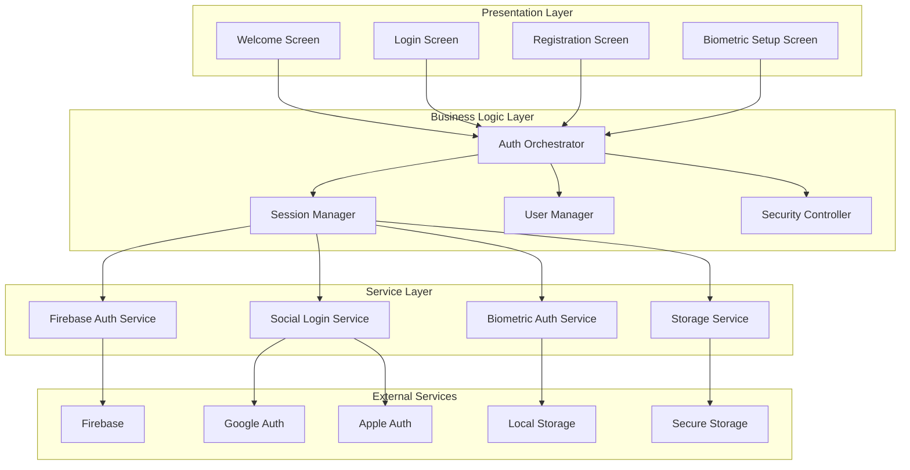
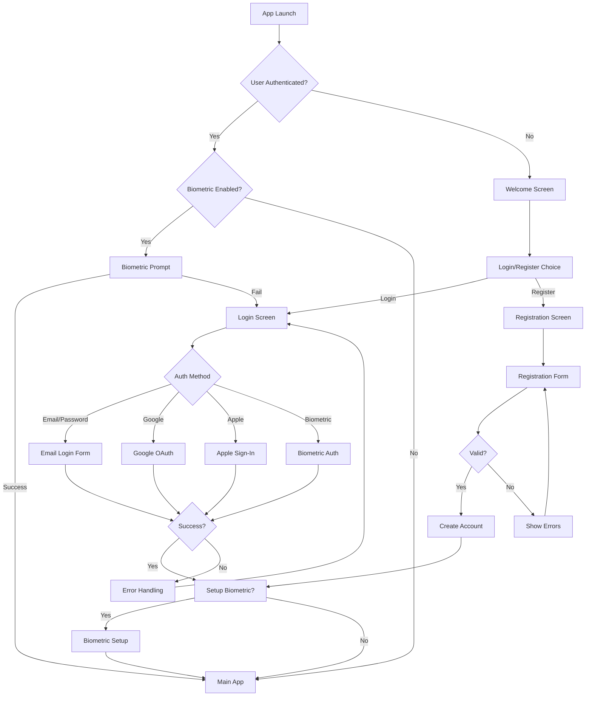

# Design Document: Modern Authentication System

## Overview

Bu tasarım, mevcut karmaşık ve dağınık giriş sistemini modern, kullanıcı dostu ve güvenli bir deneyime dönüştürmek için kapsamlı bir çözüm sunar. Sistem, Firebase Authentication'ı temel alarak biyometrik doğrulama, sosyal medya girişleri ve güvenli oturum yönetimini tek bir akışta birleştirir.

Tasarım, kullanıcı deneyimini önceleyerek karmaşık teknik detayları arka planda gizler ve kullanıcılara sezgisel, hızlı ve güvenli bir giriş deneyimi sunar. Modern mobil uygulama standartlarına uygun olarak tasarlanan sistem, hem güvenlik hem de kullanılabilirlik açısından en iyi uygulamaları benimser.

## Architecture

### High-Level Architecture



### Component Architecture

Sistem, katmanlı mimari prensiplerine uygun olarak tasarlanmıştır:

1. **Presentation Layer**: Kullanıcı arayüzü bileşenleri
2. **Business Logic Layer**: İş mantığı ve koordinasyon
3. **Service Layer**: Teknik servisler ve dış entegrasyonlar
4. **Data Layer**: Veri depolama ve yönetimi

## Components and Interfaces

### Auth Orchestrator

Ana koordinatör bileşen olarak tüm authentication akışlarını yönetir:

```dart
class AuthOrchestrator {
  Future<AuthResult> authenticate(AuthMethod method, Map<String, dynamic> credentials);
  Future<void> logout();
  Future<bool> isAuthenticated();
  Stream<AuthState> get authStateStream;
}
```

**Sorumlulukları:**
- Farklı auth yöntemlerini koordine etme
- Auth state'ini yönetme
- Error handling ve recovery
- User experience akışını kontrol etme

### Session Manager

Kullanıcı oturumlarını güvenli şekilde yönetir:

```dart
class SessionManager {
  Future<void> createSession(User user);
  Future<void> extendSession();
  Future<void> invalidateSession();
  Future<bool> isSessionValid();
  Future<bool> requiresReauth();
}
```

**Özellikler:**
- Configurable session timeout
- Background/foreground state tracking
- Sensitive operation detection
- Automatic session renewal

### Biometric Auth Service

Biyometrik doğrulama işlemlerini yönetir:

```dart
class BiometricAuthService {
  Future<bool> isAvailable();
  Future<List<BiometricType>> getAvailableTypes();
  Future<AuthResult> authenticate(String reason);
  Future<void> enableBiometric();
  Future<void> disableBiometric();
}
```

**Güvenlik Özellikleri:**
- Hardware-backed authentication
- Fallback mechanism
- Rate limiting
- Secure enclave integration

### Social Login Service

Sosyal medya girişlerini yönetir:

```dart
class SocialLoginService {
  Future<AuthResult> signInWithGoogle();
  Future<AuthResult> signInWithApple();
  Future<void> linkAccount(String provider);
  Future<void> unlinkAccount(String provider);
}
```

**Provider Support:**
- Google Sign-In
- Apple Sign-In
- Account linking/unlinking
- Profile synchronization

## Data Models

### User Model

```dart
class User {
  final String id;
  final String email;
  final String? displayName;
  final String? photoUrl;
  final List<AuthProvider> providers;
  final DateTime createdAt;
  final DateTime lastLoginAt;
  final UserPreferences preferences;
}
```

### Auth State Model

```dart
class AuthState {
  final AuthStatus status;
  final User? user;
  final List<AuthMethod> availableMethods;
  final bool requiresBiometric;
  final String? errorMessage;
}

enum AuthStatus {
  unauthenticated,
  authenticating,
  authenticated,
  requiresSetup,
  error
}
```

### Session Model

```dart
class Session {
  final String sessionId;
  final String userId;
  final DateTime createdAt;
  final DateTime expiresAt;
  final DateTime lastActivity;
  final SessionType type;
  final Map<String, dynamic> metadata;
}
```

### Security Configuration

```dart
class SecurityConfig {
  final Duration sessionTimeout;
  final Duration backgroundLockDelay;
  final bool requireBiometricForSensitive;
  final int maxFailedAttempts;
  final Duration lockoutDuration;
}
```

## User Interface Design

### Design Principles

1. **Simplicity First**: Karmaşık teknik detayları gizleyerek sade arayüz
2. **Progressive Disclosure**: İhtiyaç duyuldukça bilgi ve seçenekleri gösterme
3. **Consistent Branding**: Mevcut app tasarımı ile uyumlu görsel dil
4. **Accessibility**: Tüm kullanıcılar için erişilebilir tasarım
5. **Performance**: Hızlı yükleme ve responsive etkileşimler

### Screen Flow



### Visual Design Elements

**Color Scheme:**
- Primary: #FDB32A (Existing brand color)
- Secondary: #1E3A3A (Dark teal)
- Success: #4CAF50
- Error: #F44336
- Warning: #FF9800
- Background: Gradient from #0f2027 to #2c5364

**Typography:**
- Headers: Bold, 24-28px
- Body: Regular, 16px
- Captions: Regular, 14px
- Buttons: Semi-bold, 16px

**Components:**
- Rounded corners (12px radius)
- Subtle shadows and elevation
- Smooth animations (300-500ms)
- Consistent spacing (8px grid system)

## Error Handling

### Error Categories

1. **Network Errors**: Connection issues, timeouts
2. **Authentication Errors**: Invalid credentials, account issues
3. **Biometric Errors**: Hardware issues, enrollment problems
4. **Validation Errors**: Form validation, input errors
5. **System Errors**: Unexpected failures, service unavailable

### Error Recovery Strategies

```dart
class ErrorHandler {
  Future<void> handleAuthError(AuthError error) {
    switch (error.type) {
      case AuthErrorType.networkError:
        return _handleNetworkError(error);
      case AuthErrorType.invalidCredentials:
        return _handleCredentialError(error);
      case AuthErrorType.biometricUnavailable:
        return _handleBiometricError(error);
      case AuthErrorType.accountLocked:
        return _handleAccountLocked(error);
      default:
        return _handleGenericError(error);
    }
  }
}
```

### User-Friendly Error Messages

- **Network Issues**: "Bağlantı sorunu yaşanıyor. Lütfen internet bağlantınızı kontrol edin."
- **Invalid Login**: "E-posta veya şifre hatalı. Lütfen tekrar deneyin."
- **Biometric Fail**: "Parmak izi tanınamadı. Şifre ile giriş yapmak ister misiniz?"
- **Account Locked**: "Güvenlik nedeniyle hesabınız geçici olarak kilitlendi."

## Testing Strategy

### Unit Testing

**Core Components:**
- AuthOrchestrator logic
- Session management
- Validation functions
- Error handling

**Test Coverage:**
- Minimum %90 code coverage
- All business logic paths
- Error scenarios
- Edge cases

### Integration Testing

**Service Integration:**
- Firebase Auth integration
- Biometric service integration
- Social login flows
- Data synchronization

### End-to-End Testing

**User Flows:**
- Complete registration flow
- Login with different methods
- Biometric setup and usage
- Session timeout scenarios
- Error recovery flows

### Property-Based Testing

Property-based testler, sistem genelinde tutarlılığı ve güvenilirliği sağlamak için kullanılacaktır. Her property, belirli bir gereksinimi doğrular ve rastgele girdi setleri üzerinde test edilir.

*A property is a characteristic or behavior that should hold true across all valid executions of a system-essentially, a formal statement about what the system should do. Properties serve as the bridge between human-readable specifications and machine-verifiable correctness guarantees.*

## Correctness Properties

### Property 1: Authentication Method Success
*For any* valid authentication method (email/password, Google, Apple, biometric) and valid credentials, the authentication should succeed and transition the user to the authenticated state
**Validates: Requirements 2.1, 3.1, 3.2, 4.3**

### Property 2: Comprehensive Error Handling
*For any* authentication error or system failure, the system should provide appropriate error messages, recovery options, and fallback mechanisms without exposing sensitive information
**Validates: Requirements 1.4, 2.2, 3.4, 4.4, 6.4, 10.1, 10.2, 10.3**

### Property 3: Session Management Consistency
*For any* successful authentication, a secure session should be created, properly managed according to security policies, and require re-authentication when expired or for sensitive operations
**Validates: Requirements 5.1, 5.2, 5.3, 5.4**

### Property 4: Data Synchronization Integrity
*For any* user data change or authentication event, the data should be consistently synchronized between Firebase and local storage, with Firebase serving as the source of truth for conflict resolution
**Validates: Requirements 9.1, 9.2, 9.4**

### Property 5: Security Layer Enforcement
*For any* authentication data storage, transmission, or sensitive operation, the security layer should enforce encryption, secure storage, rate limiting, and additional verification as required
**Validates: Requirements 7.1, 7.2, 7.3, 7.4**

### Property 6: User Interface Consistency
*For any* authentication screen or form interaction, the UI should maintain consistent design patterns, provide real-time validation feedback, and work across different device configurations
**Validates: Requirements 8.1, 8.2, 8.5**

### Property 7: Biometric Authentication Management
*For any* biometric authentication interaction, the system should properly detect availability, securely store settings, provide fallback options on failure, and allow user control over enablement
**Validates: Requirements 4.1, 4.2, 4.4, 4.5**

### Property 8: Registration Process Integrity
*For any* user registration attempt, the system should validate all required fields, enforce terms acceptance, create both Firebase and local profiles on success, and provide clear guidance on failure
**Validates: Requirements 6.2, 6.3, 6.4, 6.5**

### Property 9: Authentication Preference Persistence
*For any* user authentication preference or "Remember Me" setting, the system should persist the preference across app sessions and apply it consistently
**Validates: Requirements 1.5, 2.5**

### Property 10: Account Linking and Social Auth Management
*For any* social authentication success or account linking scenario, the system should properly create/update user profiles and handle multiple authentication methods for the same user
**Validates: Requirements 3.3, 3.5**

### Property 11: Accessibility and Privacy Compliance
*For any* UI component or error logging operation, the system should support accessibility features and protect user privacy while maintaining functionality
**Validates: Requirements 8.4, 10.5**

### Property 12: Configuration and Migration Handling
*For any* session timeout configuration or existing user data migration, the system should apply settings correctly and handle data migration seamlessly
**Validates: Requirements 5.5, 9.5**

### Property 13: Offline Functionality and Sync
*For any* offline scenario, the system should use local storage appropriately and synchronize data when connection is restored
**Validates: Requirements 9.3**